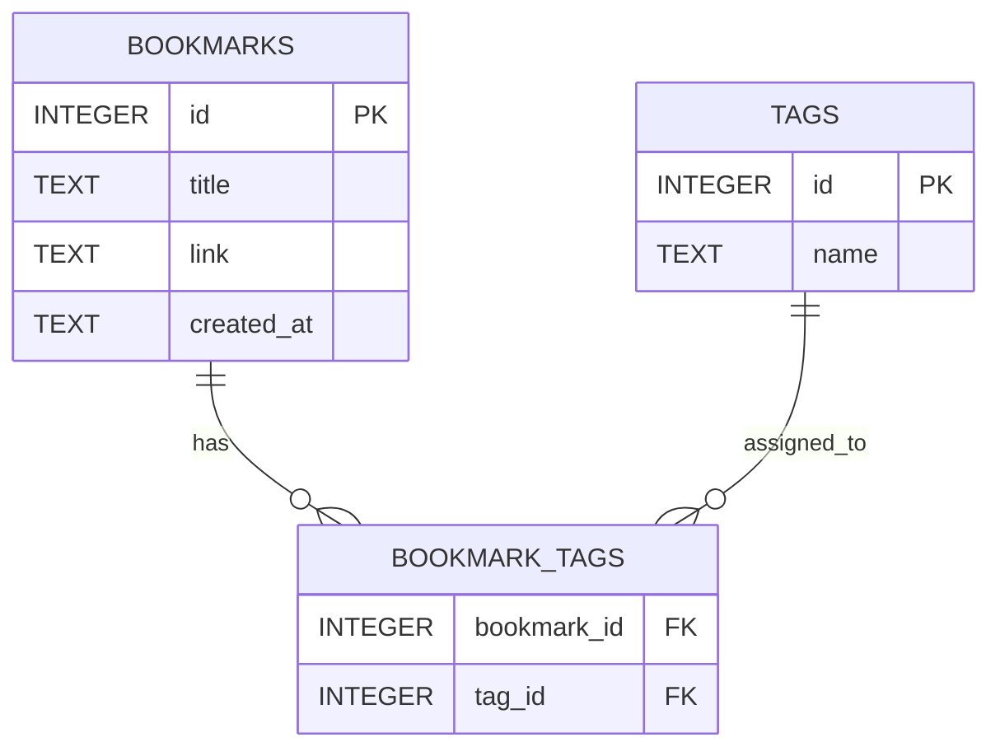

## Database ER Diagram

```mermaid
erDiagram
    BOOKMARKS {
        INTEGER id PK
        TEXT title
        TEXT link
        TEXT created_at
    }

    TAGS {
        INTEGER id PK
        TEXT name
    }

    BOOKMARK_TAGS {
        INTEGER bookmark_id FK
        INTEGER tag_id FK
    }

    BOOKMARKS ||--o{ BOOKMARK_TAGS : has
    TAGS ||--o{ BOOKMARK_TAGS : assigned_to
```
