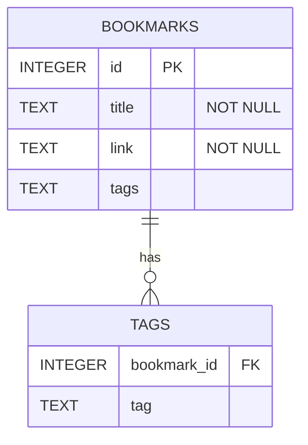

# Peywand CLI – Technical Documentation

## 1. Overview

**Peywand** is a command-line application for managing bookmarks stored
in a local `SQLite` database. It supports adding, listing, updating,
deleting, importing, and exporting bookmarks in multiple formats via a
**plugin-based I/O architecture**.

Key goals of the design:

* Clear separation of concerns (CLI, persistence, presentation,
  I/O formats)
* Extensibility via plugins (HTML, JSON, CSV, …)
* Testability (isolated unit tests, no hard DB coupling)
* Modern Python idioms (type hints, dataclasses, context managers)

---

## 2. High-Level Architecture

```mermaid
graph TD
    CLI[CLI Entry Point (main.py)] --> Handlers[Command Handlers (handle_add, handle_list, …)]

    Handlers --> DB[Database Layer (pw.db)]
    Handlers --> Plugins[Import/Export Plugins]

    Plugins --> HTML[HTML Plugin]
    Plugins --> JSON[JSON Plugin]
    Plugins --> CSV[CSV Plugin]

    DB --> SQLite[SQLite Database (~/.pw.db)]
```

---

## 3. Core Concepts

### 3.1 Bookmark Model

Bookmarks are represented using a frozen dataclass:

* `id: int | None` – database primary key
* `title: str` – human-readable title
* `link: str` – URL
* `tags: str` – semicolon-separated tag list

The model is intentionally simple and storage-agnostic.

---

### 3.2 Database Session Management

The database layer exposes a **session factory** created at startup:

```python
SessionLocal = db.create_engine_and_session(DB_PATH)
```

Usage pattern (everywhere):

```python
with SessionLocal() as session:
    ...
```

This design:

* avoids global sessions
* makes testing easier
* allows plugins to receive a session factory instead of importing
  DB internals

### 3.3 Database ER Diagram


---

## 4. Command Handlers

The main module defines **one handler per CLI command**. Each handler:

* validates CLI arguments
* performs a single responsibility
* delegates work to the DB or plugins

### 4.1 `handle_init()`

Initializes the database:

* creates the `SQLite` file if missing
* creates all required tables

Idempotent and safe to run multiple times.

---

### 4.2 `handle_add()`

Adds a new bookmark using CLI arguments:

* `--title`
* `--link`
* `--tags`

Duplicate links are rejected by the database layer.

---

### 4.3 `handle_list()`

Lists bookmarks with optional filters:

* title
* link
* tags

Behavior:

* queries DB
* sorts results by title
* renders output via `bookmark_view.print_search_result()`

---

### 4.4 `handle_delete()`

Deletes bookmarks by:

* ID (preferred)
* strict title + link match

Safety features:

* aborts deletion if multiple matches are found
* prints user-friendly feedback

---

### 4.5 `handle_update()`

Updates an existing bookmark identified by ID.

Requirements:

* ID must be provided
* fields not supplied remain unchanged (handled in DB layer)

---

## 5. Import / Export Plugin System

### 5.1 Motivation

Import/export formats change frequently. Hardcoding them into the CLI would:

* increase coupling
* complicate testing
* make extensions risky

Instead, Peywand uses a **plugin registry**.

---

### 5.2 Plugin Protocol

Each plugin must implement:

```python
class ImportExportPlugin(Protocol):
    format: str
    def import_data(self, path: Path, session_factory): ...
    def export_data(self, path: Path, bookmarks: list[Bookmark]): ...
```

---

### 5.3 Plugin Registry

The registry:

* stores plugins by format name (`json`, `html`, `csv`, …)
* raises clear errors for unknown formats

Plugins register themselves on import:

```python
register(JSONPlugin())
```

---

### 5.4 Built-in Plugins

| Plugin | File             | Description                        |
| ------ | ---------------- | ---------------------------------- |
| HTML   | `html_plugin.py` | Browser-compatible bookmark export |
| JSON   | `json_plugin.py` | Structured machine-readable format |
| CSV    | `csv_plugin.py`  | Spreadsheet-friendly format        |

---

### 5.5 Import Flow

```
CLI -> registry.get(format)
    -> plugin.import_data(path, SessionLocal)
        -> open file
        -> parse entries
        -> db.insert_bookmark()
```

---

### 5.6 Export Flow

```
CLI -> query bookmarks
    -> registry.get(format)
        -> plugin.export_data(path, bookmarks)
```

---

## 6. Error Handling Strategy

* Invalid rows during import are skipped
* Duplicate bookmarks are ignored
* Unknown formats raise a controlled `ValueError`
* User-facing messages are printed at CLI level

This keeps plugins robust and non-interactive.

---

## 7. Testing Strategy

### 7.1 Plugin Unit Tests

Each plugin is tested in isolation:

* temporary files (`tmp_path`)
* fake DB sessions
* `monkeypatch` for `db.insert_bookmark`

No real database is required.

### 7.2 Registry Tests

The registry is tested for:

* successful registration
* duplicate detection
* unknown format errors

---

## 8. Extending Peywand

### 8.1 Adding a New Import/Export Format

1. Create a new plugin module:

   ```python
   class YAMLPlugin:
       format = "yaml"
       ...
   ```
2. Call `register(YAMLPlugin())`
3. Import the plugin module in `pw/plugins/__init__.py`

No CLI or core code changes required.

---

## 9. Design Principles Recap

* **Single responsibility** per handler
* **Dependency injection** via session factory
* **Explicit plugin registration** (no magic discovery)
* **Fail-safe imports** (skip bad rows, continue processing)
* **Modern Python** (type hints, dataclasses, context managers)

---

## 10. Conclusion

The refactored *Peywand* main module serves as a thin orchestration
layer that:

* routes commands
* coordinates DB access
* delegates format-specific work to plugins

This structure keeps the system maintainable, testable, and easy to
extend as new formats or features are added.
