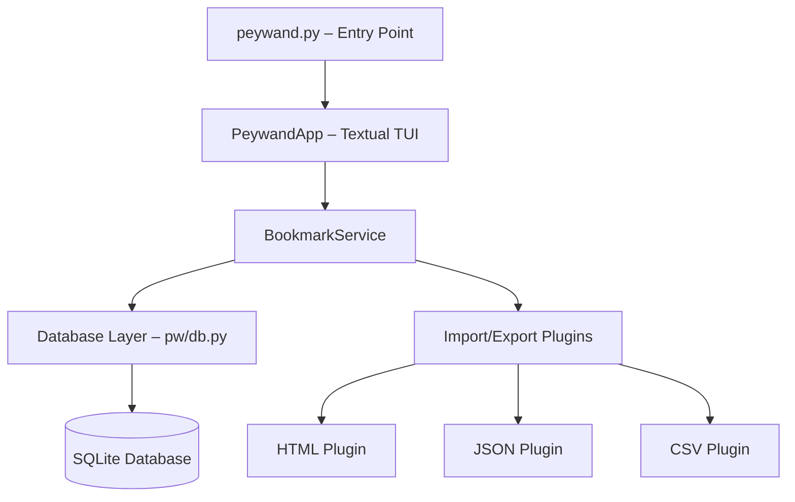
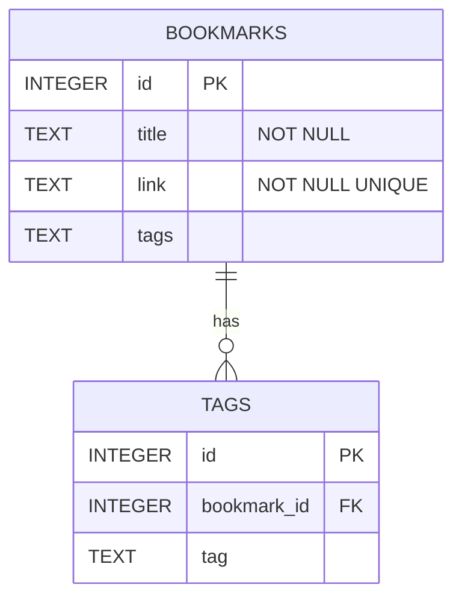

# Peywand – Technical Documentation

## 1. Overview

**Peywand** is a terminal bookmark manager built on a local SQLite
database. The user interface is a [Textual](https://textual.textualize.io/)
TUI that supports browsing, filtering, adding, editing, deleting,
importing, and exporting bookmarks.

Key design goals:

* Clear separation of concerns (TUI, service layer, persistence,
  presentation, I/O formats)
* Extensibility via a plugin registry (HTML, JSON, CSV, …)
* Testability (isolated unit tests, no hard DB coupling in plugins)
* Modern Python idioms (type hints, frozen dataclasses, context managers)

---

## 2. High-Level Architecture


```mermaid
graph TD
    Entry[peywand.py – Entry Point] --> TUI[PeywandApp – Textual TUI]

    TUI --> Service[BookmarkService]

    Service --> DB[Database Layer – pw/db.py]
    Service --> Plugins[Import/Export Plugins]

    Plugins --> HTML[HTML Plugin]
    Plugins --> JSON[JSON Plugin]
    Plugins --> CSV[CSV Plugin]

    DB --> SQLite[(SQLite Database)]
```

---

## 3. Core Concepts

### 3.1 Bookmark Model

Bookmarks are represented as a frozen, slotted dataclass (`pw/bookmark.py`):

```python
@dataclass(slots=True, frozen=True)
class Bookmark:
    id: int | None   # database primary key; None before insertion
    title: str
    link: str
    tags: str        # semicolon-separated, e.g. "dev;news"
```

The model is storage-agnostic and shared across all layers.

---

### 3.2 Database Session Management

`db.create_engine_and_session` creates the SQLite engine and a session
factory together, returning both:

```python
engine, SessionLocal = db.create_engine_and_session(db_path)
```

All database operations use the session factory as a context manager:

```python
with SessionLocal() as session:
    db.insert_bookmark(session, bookmark)
```

This design:

* avoids global sessions
* makes testing straightforward (swap in a fake factory)
* lets plugins receive a session factory without importing DB internals

### 3.3 Database ER Diagram


```mermaid
erDiagram
    BOOKMARKS {
        INTEGER id PK
        TEXT title "NOT NULL"
        TEXT link "NOT NULL UNIQUE"
        TEXT tags
    }

    TAGS {
        INTEGER id PK
        INTEGER bookmark_id FK
        TEXT tag
    }

    BOOKMARKS ||--o{ TAGS : has
```

Tags are stored in a separate table to support efficient tag-based
queries. The `CASCADE DELETE` constraint ensures tag rows are removed
when their parent bookmark is deleted.

---

## 4. Service Layer

`BookmarkService` (`pw/services.py`) is the single entry point for all
bookmark operations. The TUI and tests interact exclusively through this
class — neither touches the database layer directly.

### Public API

| Method | Description |
|---|---|
| `initialize_database()` | Creates the schema (idempotent) |
| `list_bookmarks(filters?)` | Returns bookmarks sorted by title, with optional filtering |
| `get_bookmark(id)` | Fetches a single bookmark by ID |
| `add_bookmark(title, link, tags)` | Inserts and returns the new bookmark |
| `update_bookmark(id, title, link, tags)` | Updates and returns the modified bookmark |
| `delete_bookmark(id)` | Deletes a bookmark by ID |
| `import_bookmarks(path, file_format)` | Delegates to the matching plugin |
| `export_bookmarks(path, file_format, filters?)` | Exports the current filtered result set |
| `available_formats()` | Returns the list of registered plugin format names |
| `close()` | Disposes the database engine |

### BookmarkFilters

Filtering is expressed through a frozen dataclass:

```python
@dataclass(slots=True, frozen=True)
class BookmarkFilters:
    title: str = ""
    link: str = ""
    tags: str = ""   # semicolon-separated
```

When all fields are empty, `list_bookmarks` returns all bookmarks.
When any field is set, only matching bookmarks are returned.

---

## 5. TUI Layer

`PeywandApp` (`pw/tui.py`) is a [Textual](https://textual.textualize.io/)
`App` subclass. It owns a `BookmarkService` instance and drives all
user interactions.

### Layout

```
┌─ Header ──────────────────────────────────────────────────────┐
│ ┌─ Sidebar ──────────┐  ┌─ Main Pane ──────────────────────┐ │
│ │ Filter inputs      │  │ Bookmarks DataTable              │ │
│ │ Apply / Clear      │  │ Add / Edit / Delete toolbar      │ │
│ │ Import / Export    │  │                                  │ │
│ │ Stats              │  │                                  │ │
│ │ Selected details   │  │                                  │ │
│ └────────────────────┘  └──────────────────────────────────┘ │
└─ Footer (key bindings) ───────────────────────────────────────┘
```

### Key Bindings

| Key | Action |
|-----|--------|
| `a` | Add bookmark |
| `e` | Edit selected bookmark |
| `d` | Delete selected bookmark |
| `i` | Import bookmarks |
| `x` | Export current results |
| `r` | Refresh table |
| `q` | Quit |

### Modal Screens

| Screen | Purpose |
|--------|---------|
| `BookmarkFormScreen` | Add / edit form (title, link, tags) |
| `FileActionScreen` | Import / export form (format selector + path) |
| `ConfirmScreen` | Delete confirmation dialog |

---

## 6. Import / Export Plugin System

### 6.1 Motivation

Import/export formats change independently of the rest of the
application. A plugin registry decouples format handling from the
service and TUI layers, making it easy to add new formats without
touching existing code.

---

### 6.2 Plugin Protocol

Each plugin must satisfy the `ImportExportPlugin` protocol
(`pw/plugins/io.py`):

```python
class ImportExportPlugin(Protocol):
    format: str  # "html", "json", "csv", …

    def import_data(self, path: Path, session_factory: Callable) -> None: ...
    def export_data(self, path: Path, bookmarks: list[Bookmark]) -> None: ...
```

---

### 6.3 Plugin Registry

The registry (`pw/plugins/registry.py`) maps format names to plugin
instances. Plugins self-register at import time:

```python
register(JSONPlugin())
```

All plugins are loaded by importing `pw.plugins` (done automatically
by `BookmarkService`).

Key registry functions:

| Function | Description |
|----------|-------------|
| `register(plugin)` | Registers a plugin; raises if format already registered |
| `get(format_name)` | Returns the plugin; raises `ValueError` for unknown formats |
| `available_formats()` | Returns a sorted list of registered format names |

---

### 6.4 Built-in Plugins

| Plugin | File | Format |
|--------|------|--------|
| `HTMLPlugin` | `html_plugin.py` | Browser-compatible bookmark list |
| `JSONPlugin` | `json_plugin.py` | Structured machine-readable format |
| `CSVPlugin` | `csv_plugin.py` | Spreadsheet-friendly format |

All plugins show a `tqdm` progress bar during both import and export.

**HTML format** uses Python's standard `html.parser.HTMLParser` to
parse entries reliably:

```html
<li title="tag1,tag2"><a href="https://example.com">Title</a></li>
```

**JSON format** expects a top-level array of objects:

```json
[
  { "title": "Example", "link": "https://example.com", "tags": "demo" }
]
```

**CSV format** uses the header `title,link,tags`.

---

### 6.5 Import Flow

```
BookmarkService.import_bookmarks(path, format)
  └─ registry.get(format)
       └─ plugin.import_data(path, session_factory)
            ├─ parse file entries
            └─ db.insert_bookmark(session, bookmark)  [per entry]
```

Invalid or duplicate entries are skipped silently.

---

### 6.6 Export Flow

```
BookmarkService.export_bookmarks(path, format, filters)
  ├─ list_bookmarks(filters)   → sorted list of Bookmark
  └─ registry.get(format)
       └─ plugin.export_data(path, bookmarks)
```

---

## 7. Error Handling Strategy

| Situation | Behaviour |
|-----------|-----------|
| Invalid row during import | Skipped silently |
| Duplicate bookmark link | `ValueError` raised by DB layer; plugin skips |
| Unknown format name | `ValueError` raised by registry |
| Bookmark not found by ID | `ValueError` raised by DB layer |
| Missing title or link in TUI form | User notified inline; form stays open |
| OS / IO errors in TUI | Displayed as error notification with 8 s timeout |

---

## 8. Testing Strategy

### 8.1 Plugin Unit Tests

Each plugin is tested in isolation using:

* `tmp_path` for temporary files
* A lightweight fake session / session factory from `conftest.py`
* `monkeypatch` to intercept `db.insert_bookmark`

No real database is required for plugin tests.

### 8.2 Service Integration Tests

`tests/test_services.py` exercises the full stack (service → DB →
SQLite) using a temporary database file:

* CRUD operations and filtering
* Round-trip export → import via JSON

### 8.3 Database Unit Tests

`tests/test_peywand.py` tests the database layer directly against an
in-memory SQLite database, covering insert, update, delete, and
`bookmark_view` rendering.

### 8.4 Registry Tests

`tests/plugins/test_registry.py` covers:

* successful plugin registration
* duplicate format detection
* unknown format error

---

## 9. Extending Peywand

### 9.1 Adding a New Import/Export Format

1. Create a new plugin module, e.g. `pw/plugins/yaml_plugin.py`:

   ```python
   from pw.plugins.registry import register

   class YAMLPlugin:
       format = "yaml"

       def import_data(self, path, session_factory): ...
       def export_data(self, path, bookmarks): ...

   register(YAMLPlugin())
   ```

2. Import it in `pw/plugins/__init__.py`:

   ```python
   from pw.plugins.yaml_plugin import YAMLPlugin  # noqa
   ```

No changes to the service layer, TUI, or registry are required.
